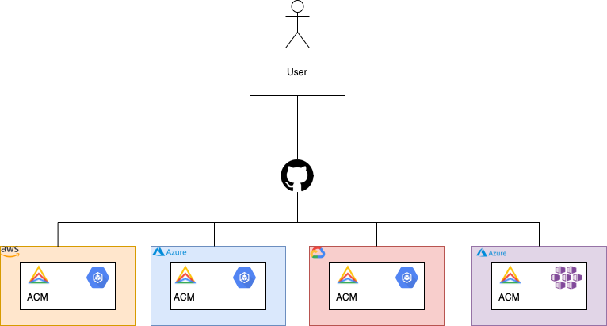

# Anthos Config Management Demo

## Pre-requisites

- Anthos cluster on GCP
- Anthos cluster on AWS
- Anthos cluster on Azure
- Attached Anthos cluster

## Hight level workflow



## Install ACM on Anthos on GCP

```shell
kubectl apply -f assets/config-management-operator.yaml
kubectl apply -f assets/config-management-gcp.yaml
kubectl apply -f assets/root-sync.yaml
```

## Install ACM on Anthos on AWS

```shell
kubectl apply -f assets/config-management-operator.yaml
kubectl apply -f assets/config-management-aws.yaml
kubectl apply -f assets/root-sync.yaml
```

## Install ACM on Anthos on Azure

```shell
kubectl apply -f assets/config-management-operator.yaml
kubectl apply -f assets/config-management-azure.yaml
kubectl apply -f assets/root-sync.yaml
```

## Install ACM on Attached Anthos clusters

```shell
kubectl apply -f assets/config-management-operator.yaml
kubectl apply -f assets/config-management-attached.yaml
kubectl apply -f assets/root-sync.yaml
```


